| ID | Summary | Severity | Priority | Status | Steps to Reproduce | Expected Result | Actual result | Description | Attachment | Annotation |
| ------- | ------- | ------- | ------- | ------- | ------- | ------- | ------- | ------- | ------- | ------- |
| 1 | Некорректное отображение хлебных крошек при переходе в раздел "На длительный срок" | S3 - Значительный | P1 - Высокий | Открыт | 1.Открыть главную страницу сайта2.Перейти "Недвижимость → Дома, дачи, коттеджи → Снять → На длительный срок"3.Проверить заголовок страницы | Заголовок должен соответствовать выбраному пути. | Заголовок отображает "Посуточная аренда домов, дач, коттеджей, танухаусов в Москве и МО", что не соответствует выбранному фильтру | Заголовок показывает контент для посуточной аредны, что вводит в заблуджение,хотя было выбрано "На длительный срок". |  | Был выбран высокий приоритет и значительная критичность, баг не мешает работе основного функционала, но вводит в заблуждение пользователей |
| 2 | Некорректная геолокация: при выборе "Москва и Московская область" отображаются товары и карта Санкт-Петербурга | S3 - Значительный | P1 - Высокий | Открыт | 1.Открыть главную страницу сайта2.Выбрать регион "Москва и Московская область" справа от кнопки "Найти" на верхней панеле.3.Перейти "Недвижимость → Дома, дачи, коттеджи → Снять → На длительный срок"4.Проверить карту и список товаров. | Должны отображаться товары и карта Москвы и Московской области | Отображается недвижимость и карта Санкт-Петербурга, что не соответствует выбранному региону | Система игнорирует выбранный регион, подгружая данные для другого города, что является критичным для пользователей, ищущих жилье в конкретном регионе |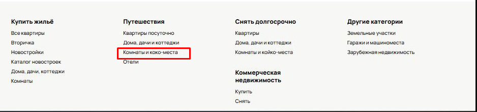 | Был выбран высокий приоритет и значительная критичность, баг не мешает работе основного функционала, |
| 3 | Некорретная сортировка недвижимости по "Дате" | S3 - Значительный | P1 - Высокий | Открыт | 1.Открыть главную страницу сайта2.Выбрать регион "Москва и Московская область" справа от кнопки "Найти" на верхней панеле.3.Перейти "Недвижимость → Дома, дачи, коттеджи → Снять → На длительный срок"4.Обратить внимание на порядок отображения недвижимости. | При установки предельной цены, должно выводится только та недвижимость, которая входит в заданный ценевой диапазон | Сортировка неккоретна. | Баг может приводить к путанице у пользователей и усложнять выбор недвижимости | 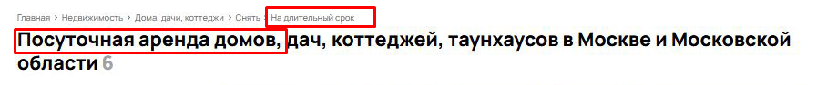 | Был выбран высокий приоритет и значительная критичность, баг не мешает работе основного функционала, но вводит в заблуждение пользователей |
| 4 | Отображение недвижимости дороже указанного лимита | S3 - Значительный | P1 - Высокий | Открыт | 1.Открыть главную страницу сайта2.Выбрать регион "Москва и Московская область" справа от кнопки "Найти" на верхней панеле.3.Перейти "Недвижимость → Дома, дачи, коттеджи → Снять → На длительный срок"4.Слева на панеле установить фильтр предельной цены, заполнив TextBox "До"5.Обратить внимание на цену недвижимости | На странице должны отображаться только те объекты недвижимости, стоимость аренды которых не превышает указанное в фильтре значение в поле "До" | На странице отображаются объекты, цена которых превышает значение, указанное в поле "До". | Баг может сбивать столку пользователей, которые ожидают увидеть только доступные им по бюджету объекты | 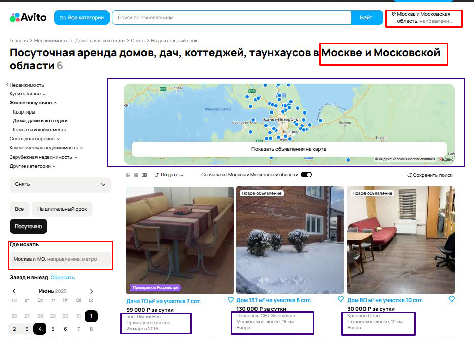 | Был выбран высокий приоритет и значительная критичность, баг не мешает работе основного функционала, но вводит в заблуждение пользователей |
| 5 | Отображение надписи "Ничего не найдено в выбранной области поиска" внизу страницы | S3 - Значительный | P1 - Высокий | Открыт | 1.Открыть главную страницу сайта2.Выбрать регион "Москва и Московская область" справа от кнопки "Найти" на верхней панеле.3.Перейти "Недвижимость → Дома, дачи, коттеджи → Снять → На длительный срок"4.Промотать страницу на низ | При ненахождение товара надпись "Ничего не найдено в выбранной области поиска" должна ниже заголовка "Посуточная аренда домов, дач, коттеджей, таунхаусов в Москве и Московской области" | Надпись "Ничего не найдено в выбранной области поиска" находится внизу страницы сайта | Баг может сбивать столку пользователей. | 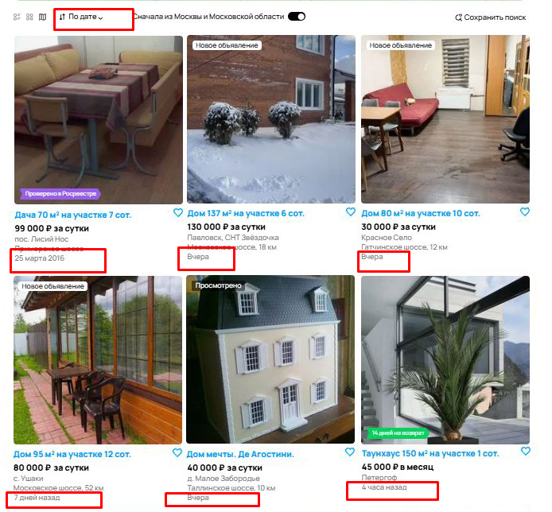 | Был выбран высокий приоритет и значительная критичность, баг не мешает работе основного функционала, но вводит в заблуждение пользователей |
| 6 | Не отображает цену за весь период внизу карточки товара | S3 - Значительный | P2 - Средний | Открыт | 1.Открыть главную страницу сайта2.Выбрать регион "Москва и Московская область" справа от кнопки "Найти" на верхней панеле.3.Перейти "Недвижимость → Дома, дачи, коттеджи → Снять → На длительный срок"4.Установить даты для "Заезд и выезд" и нажать применить5.Внимательно посмотреть карточки недвижимости | При выставлении даты "Заезд и выезд" внизу карточки недвижимости должна отображаться цена за весь период | На некоторых карточках не отображается цена за весь период | Баг может сбивать столку пользователей, которые ожидают увидеть цену за весь период | 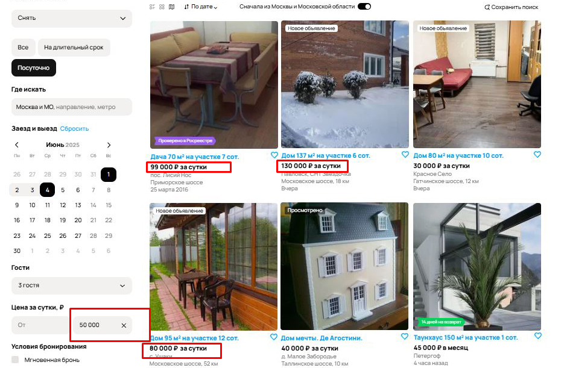 | Был выбран средний приоритет и значительная критичность, баг не мешает работе основного функционала, но вводит в заблуждение пользователей |
| 7 | Некорректное отображение карточки недвижимости на странице "Посуточная аредна домов, дач, коттеджей, таунхаусов в Москве и Московской области" | S3 - Значительный | P1 - Высокий | Открыт | 1.Открыть главную страницу сайта2.Выбрать регион "Москва и Московская область" справа от кнопки "Найти" на верхней панеле.3.Перейти "Недвижимость → Дома, дачи, коттеджи → Снять → На длительный срок"4.Посмотреть вниметально карточки невижимостей4.Найти карточку недвижимости, у которой стоит цена за месяц | При открытии страницы "Посуточная аренда " должны быть только те карточки объектов, у которых установлена цена за сутки | При выводе страницы "Посуточная аренда" вывел карточку объекта для снятия на длительный срок | Баг может приводить к путанице у пользователей и усложнять выбор недвижимости | 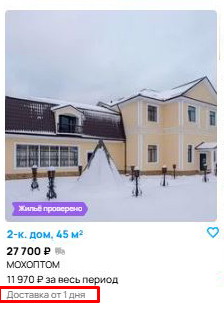 | Был выбран высокий приоритет и значительная критичность, баг не мешает работе основного функционала, но вводит в заблуждение пользователей |
| 8 | Отображение "Доставка от 1 дня" на карточке товара - недвижимости | S4 - Незначительный | P2 - Средний | Открыт | 1.Открыть главную страницу сайта2.Выбрать регион "Москва и Московская область" справа от кнопки "Найти" на верхней панеле.3.Перейти "Недвижимость → Дома, дачи, коттеджи → Снять → На длительный срок"4.Обратить на текст внизу карточки | На карточке недвижимости должны отображаться только релевантные детали. | В нижней части карточки отображается неуместная надпись "Доставка от 1 дня" | В карточке недвижимости неккоретно отображается текст "Доставка от 1 дня", что может ввести пользователя в заблуждение. | 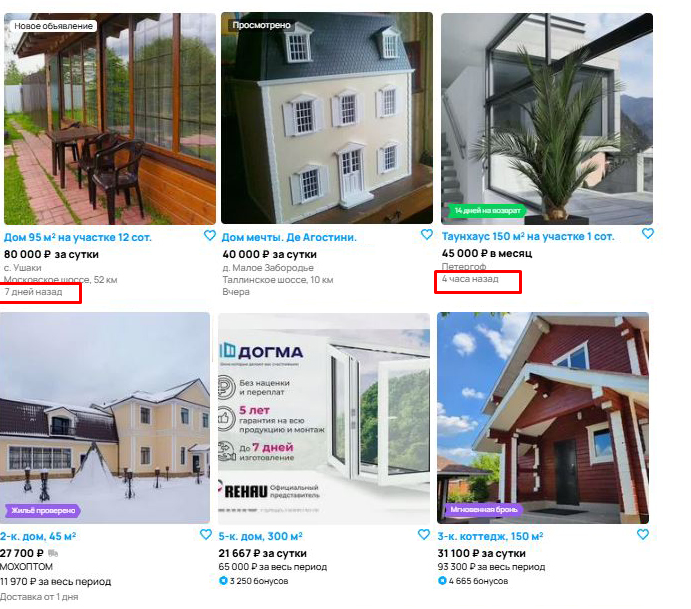 | Был выбран средний приоритет и незначительная критичность, баг не мешает работе основного функционала. |
| 9 | Неотображается дата выставления объявления | S4 - Незначительный | P2 - Средний | Открыт | 1.Открыть главную страницу сайта2.Выбрать регион "Москва и Московская область" справа от кнопки "Найти" на верхней панеле.3.Перейти "Недвижимость → Дома, дачи, коттеджи → Снять → На длительный срок"4.Обратить на текст внизу карточки | На карточке недвижимости должна отображаться дата выставления объявления | На некоторых карточках не отображается время выставления объявления | В некоторых карточках недвижимости неотображается дата выставления объявления, что может ввести пользователя в заблуждение. |  | Был выбран средний приоритет и незначительная критичность, баг не мешает работе основного функционала. |
| 10 | Отсутсвует информация о цене в карточки недвижимости без надписи "за сутки" | S4 - Незначительный | P3 - Низкий | Открыт | 1.Открыть главную страницу сайта2.Выбрать регион "Москва и Московская область" справа от кнопки "Найти" на верхней панеле.3.Перейти "Недвижимость → Дома, дачи, коттеджи → Снять → На длительный срок"4.Убедить, что строка "За сутки" отсутсвует после цены4.Найти карточку недвижимости, у которой нету информации о цене | При выставлении снятия недвижимости на сутки должно быть четкое обозначение. Например "20 000 р за сутки". | В описании товара соответствующее поле отсутствует | Баг может затруднить понимание, является ли это технической ошибкой или умышленным отсутствием информации о стоимости. | 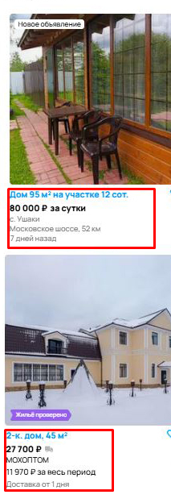 | Был выбран низкий приоритет и незначительная критичность, баг не мешает работе основного функционала. |
| 11 | Отпечатка в кнопке "Найти" | S5 - Тривиальный | P3 - Низкий | Открыт | 1.Открыть главную страницу Avito.2.Найти кнопку “Найт” в верхней панеле.3.Обратить внимание на текст на кнопке, убедившись, что он содержит опечатку в слове “Найти” | Текс на кнопке должен быть правильно написан: "Найти". | На кнопке написано "Найт", что является опечаткой | Это является незначительной ошибкой ошибкой в интерфейсе, однако может повлиять на восприятие качества сайта пользователями | 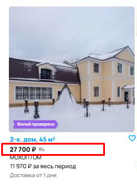 | Был выбран низкий приоритет и тривиальная критичность, баг не мешает работе основного функционала |
| 12 | Отпечатка в текстовой ссылке "Комнаты и койко-места" | S5 - Тривиальный | P3 - Низкий | Открыт | 1.Открыть страницу снятия недвижимости на сайте.2.Найти текстовую ссылку "Комнаты и коко-места" в нижней панеле3.Обратить внимание на текст в текстовой ссылке, убедившись, что он содержит опечатку в слове “койко-места” | Текс на текстовой ссылке долно быть правильно написано: "Комнаты и койко-места". | На текстовой ссылке написано "Комнаты и коко-места", что является опечаткой | Это является незначительной ошибкой ошибкой в интерфейсе, однако может повлиять на восприятие качества сайта пользователями |  | Был выбран низкий приоритет и тривиальная критичность, баг не мешает работе основного функционала |
| 13 | Отображение надписи "14 дней на возврат" на карточки объекта недвижимости | S5 - Тривиальный | P3 - Низкий | Открыт | 1.Открыть главную страницу сайта2.Выбрать регион "Москва и Московская область" справа от кнопки "Найти" на верхней панеле.3.Перейти "Недвижимость → Дома, дачи, коттеджи → Снять → На длительный срок"4.Посмотреть вниметально карточки невижимостей5.Найти карточку недвижимости, у которой есть на картинке надпись "14 дней на возврат" | Текс на кнопке должен быть правильно написан: "Найти". | При выводе страницы "Посуточная аренда" на некоторых карточках пишет "14 дней на возврат". | Баг может приводить к путанице у пользователей и вводить в заблуждение | 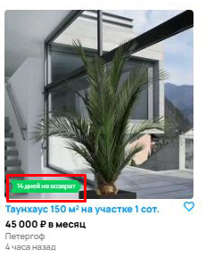 | Был выбран низкий приоритет и тривиальная критичность, баг не мешает работе основного функционала |
| 14 | Отображение иконки доставки на карточке объекта недвижимости | S5 - Тривиальный | P3 - Низкий | Открыт | 1.Открыть главную страницу сайта2.Выбрать регион "Москва и Московская область" справа от кнопки "Найти" на верхней панеле.3.Перейти "Недвижимость → Дома, дачи, коттеджи → Снять → На длительный срок"4.Посмотреть вниметально карточки невижимостей5.Найти карточку недвижимости, у которой есть значок доставки справа от цены | Иконка доставки справа от цены | При выводе страницы "Посуточная аренда" на некоторых карточках пишет отображает значок доставки | Баг может приводить к путанице у пользователей и вводить в заблуждение | 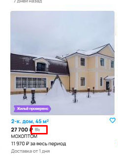 | Был выбран низкий приоритет и тривиальная критичность, баг не мешает работе основного функционала |